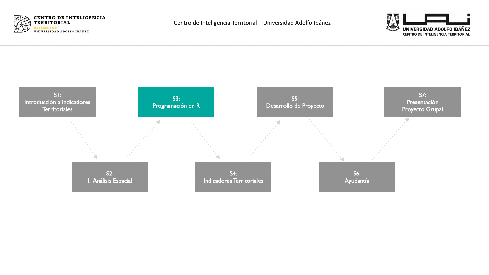
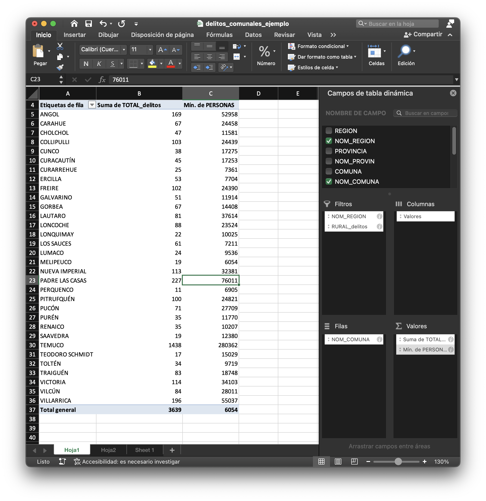

# Dataframes y Delitos en R {#sec-dataframes}

<!-- {fig-align="center"} -->

::: {.callout-note}
## Objetivo de la sesión
Aplicar un flujo completo de manipulación de datos con `dplyr` para construir un indicador territorial de delitos violentos por comuna, incluyendo filtros, categorización, resúmenes estadísticos y visualizaciones gráficas.
:::


```{r setup, include=FALSE}
knitr::opts_chunk$set(echo = TRUE)
```


## Introducción

En esta sesión se realizará un flujo de trabajo de construcción de un indicador territorial de delitos a nivel comuna utilizando R. Que contempla desde la lectura de la base de información (excel de delitos), agregar información de categorías, hacer filtros, resúmenes estadísticos (tablas dinámicas) y finalmente visualizaciones gráficas.

:::{.callout-note collapse="true"}
## Acceso a Datos de Casos Policiales Sala CEAD
La base fuen obtenida de la Sala **CEAD** (Centro de Estudios de Análisis del Delito) dependiente del la Subsecretaría de Prevención del Delito. Corresponde a datos a **nivel comunal** que da cuenta de los casos policiales conocidos por las policías para distintos grupos delictuales a partir de las detenciones flagrantes y las denuncias formales realizadas por la ciudadanía en Carabineros de Chile o la Policía de Investigaciones de Chile.

Los grupos delictuales propuestos para el análisis incorporan el concepto de daño social y penal el cual busca ponderar los delitos no solo por su frecuencia, sino también, por el impacto y gravedad de sus consecuencias. 

Consideración: A esta base de casos policiales se le agregó información administrativa de cada comuna.


Acceso a estadísticas policiales: [link](https://cead.spd.gov.cl/estadisticas-delictuales/)\
**CEAD**: Centro de Estudios de Análisis del Delito
:::


## Librerías

```{r}
library(dplyr) # manipular tablas de datos
library(sf) #manipular objetos espaciales
library(openxlsx) # trabajar con archivos Excel
library(ggplot2) # graficos estáticos 
# library(plotly) # gráficos dinámicos
```


## Lectura de una tabla


Se leerá el archivo excel que se vio la semana pasada de delitos comunales.
```{r}

delitos_tbl <- read.xlsx("data/excel/delitos_comunales.xlsx")

# str(delitos_tbl)
```
ver los primeros 6 registros

```{r}
head(delitos_tbl)
```


## Agregar Categoría

**Categorizar los Delitos**:

Primeros veremos los tipos de delitos que existen, contenidos en la columna `Subgrupo`:

```{r eval = F}
unique(delitos_tbl$Subgrupo)
```


```{r echo=FALSE}
unique(delitos_tbl$Subgrupo) %>% head()
```

* Se muestran los primeros 6 solo para buena visualización en el libro digital, en la práctica deben existir 50 categorías de delitos.

**Crear una categoría de delitos**

Se debe crear un grupo de delitos de su interés (Puede elegir los que usted quiera). Para este ejemplo se seleccionarán los delitos de violentos.


```{r}
#guardo los delitos violentos en un vector
d_agrupados <- c( "Lesiones graves o gravísimas", "Lesiones menos graves",
                  "Microtráfico de sustancias", "Otros homicidios",
                  "Robo con homicidio", "Robo violento de vehículo motorizado",
                  "Robos con violencia o intimidación", "Tráfico de sustancias")

# leves o incivilidades
# d_agrupados <- c( "Amenazas con armas", "Amenazas o riña", 
#                   "Desórdenes públicos", "Comercio ilegal" , 
#                   "Consumo de alcohol y drogas en la vía pública", 
#                   "Daños", "Lesiones leves" , "Desórdenes públicos",
#                   "Desórdenes públicos", "Ofensas al pudor",
#                   "Porte de arma cortante o punzante","Receptación",
#                   "Robo de objetos de o desde vehículo",
#                   "Robo por sorpresa" )
```


**Agregar Categoría de delitos**

Para esto crearemos una nueva columna con la función `mutate()`

```{r}
delitos_tbl <- delitos_tbl %>% 
  mutate(grupo = case_when(
    Subgrupo %in% d_agrupados ~ "Violento",
    TRUE ~ "Otro"
  ))


# head(delitos_tbl)

count(delitos_tbl, grupo)
dim(delitos_tbl)
```
## Filtros

**Filtrar por Tipo de Participante**

```{r}
delitos_filtered <- delitos_tbl %>% 
  filter(Tipo.Participante == "VICTIMA")
```

**Filtrar por Región**

```{r}
delitos_filtered <- delitos_filtered %>% 
  filter(NOM_REGION == "REGIÓN DE LA ARAUCANÍA")
```

**Filtrar por Categoría**

```{r}
delitos_filtered <- delitos_filtered %>% 
  filter(grupo == "Violento")
```

## Generar Resúmenes (similar a tablas dinámicas)



```{r}

tabla_resumen <- delitos_filtered %>% 
  group_by(NOM_COMUNA) %>% 
  summarise(total_delitos = sum(TOTAL_delitos),
            pob = min(PERSONAS))
  
tabla_resumen
```


**Ponderar por población**

```{r}
tabla_resumen <- tabla_resumen %>%
  mutate(
    del_10000_hab = round((total_delitos / pob) * 10000, 2)
  )


tabla_resumen %>%
  arrange(desc(del_10000_hab)) %>%
  head(10)
```


## Visualización gráfica

```{r eval=FALSE}
library(ggplot2)
```


```{r}
g_barra <- ggplot(tabla_resumen, aes(x = NOM_COMUNA, y = del_10000_hab)) +
  geom_bar(fill = "#6a51a3", color =  "gray90", stat = "identity", width = 0.7)+
  coord_flip()+
  theme_bw()+
  labs(title="Delitos Violentos en la Región de la Araucanía", 
       y ="Delitos Violentos / 10000 hebitantes", x = "Nombre de Comuna")+
  theme(plot.title = element_text(face = "bold",colour= "gray20", size=12)) 
  
g_barra


```

Guardar el gráfico de barras como imagen
```{r eval=FALSE}
ggsave(plot = g_barra, filename = "images/del_violentos_R09.png", width = 8, height = 7)
```


## Actividad

::: {.callout-note}
## Actividad: Análisis comparado

1. Cambia la región analizada a `REGIÓN METROPOLITANA DE SANTIAGO`.
2. Cambia los delitos seleccionados por delitos contra la propiedad.
3. Calcula la tasa por 10.000 habitantes y genera un gráfico de barras.
4. ¿Qué comunas destacan por mayor concentración de estos delitos?
:::


## Qué aprendimos hoy?

- [x] Leer y explorar una tabla de delitos comunales
- [x] Categorizar delitos en grupos de interés
- [x] Aplicar filtros por víctima, región y grupo delictual
- [x] Calcular tasas por población
- [x] Crear gráficos (básicos)


<!-- <!-- Generar gráfico dinámico --> 
<!-- ```{r eval=FALSE} -->
<!-- # library(plotly) -->
<!-- ``` -->

<!-- ```{r} -->
<!-- ggplotly(g_barra) -->

<!-- ``` -->

<!--  -->


<!-- ## Visualización Espacial -->

<!-- Primero se debe unir la tabla resumen delitos con Shapefile de comunas del INE. -->

<!-- **Leer Shapefile de comunas** -->


<!-- ```{r} -->
<!-- comunas_r09 <- st_read("data/shape/Comunas_Chile.shp") %>%  -->
<!--   filter(NOM_REGION == "REGIÓN DE LA ARAUCANÍA") -->

<!-- head(comunas_r09) -->
<!-- ``` -->

<!-- **Unir shafile con tabla resumen** -->

<!-- Se utilizará la función `left_join` -->

<!-- ```{r} -->

<!-- comunas_r09 <- comunas_r09 %>%  -->
<!--   left_join(tabla_resumen, by = "NOM_COMUNA") -->

<!-- head(comunas_r09) -->
<!-- ``` -->


<!-- ### Generar Mapa -->


<!-- ```{r} -->
<!-- library(viridis) -->
<!-- del_r09_m <- ggplot() + -->
<!--   geom_sf(data = comunas_r09, aes(fill = del_10000_hab), alpha=0.8,  size= 0.5)+ -->
<!--   scale_fill_viridis_c()+ -->
<!--   ggtitle("Delitos Violentos en la Región de la Araucanía" ) + -->
<!--   theme_bw() + -->
<!--   # theme(legend.position="none")+ -->
<!--   theme(panel.grid.major = element_line(colour = "gray80"),  -->
<!--         panel.grid.minor = element_line(colour = "gray80")) -->

<!-- del_r09_m -->
<!-- ``` -->

<!-- Guardar el Mapa como imagen -->
<!-- ```{r eval=FALSE} -->
<!-- ggsave(plot = del_r09_m, filename = "images/map_del_violentos_R09.png", width = 8, height = 7) -->
<!-- ``` -->


<!-- **Mapa Dinámico** -->


<!-- ```{r} -->
<!-- library(mapview) -->

<!-- mapview(comunas_r09, zcol = "del_10000_hab", alpha.regions = 0.9) -->
<!-- ``` -->

<!-- ## Guardar Resultados -->

<!-- ```{r eval=FALSE} -->

<!-- # Excel -->
<!-- write.xlsx(tabla_resumen, file = "data/excel/R09_del_violentos.xlsx") -->

<!-- # Shapefile  -->
<!-- st_write(comunas_r09, "data/shape/R09_del_violentos.shp", delete_dsn = T) -->

<!-- # rds -->
<!-- saveRDS(object = comunas_r09,file = "data/rds/R09_del_violentos.rds") -->

<!-- ``` -->


