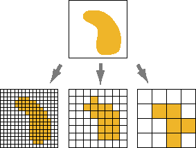
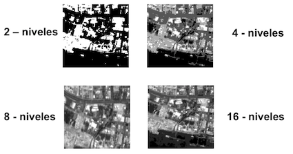
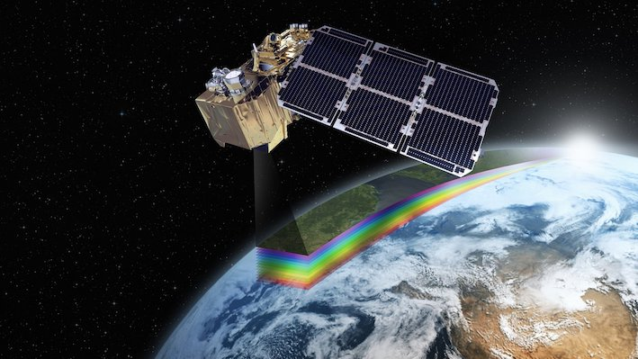
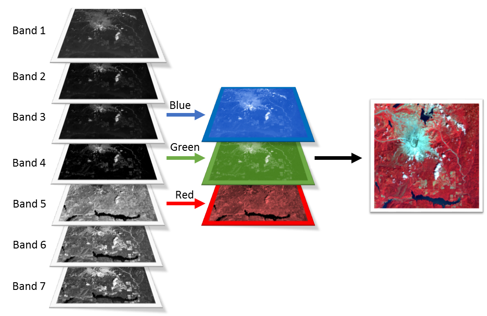
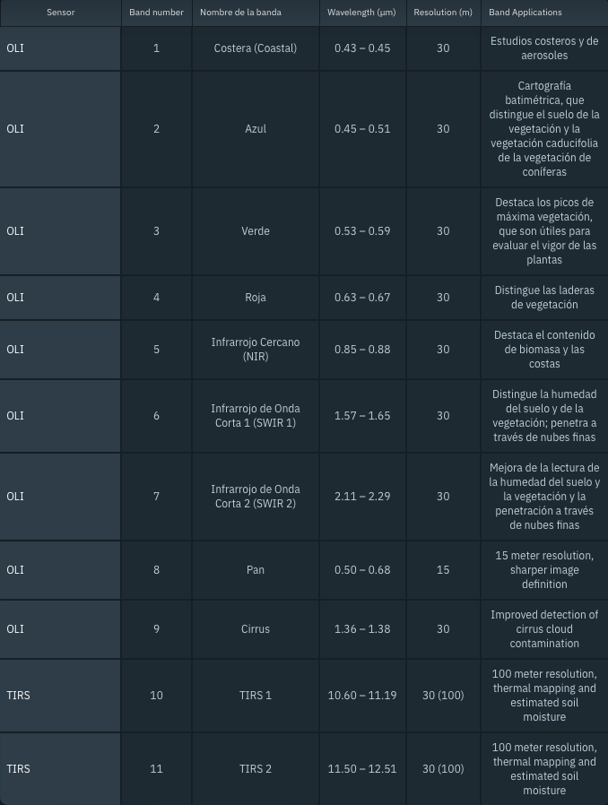
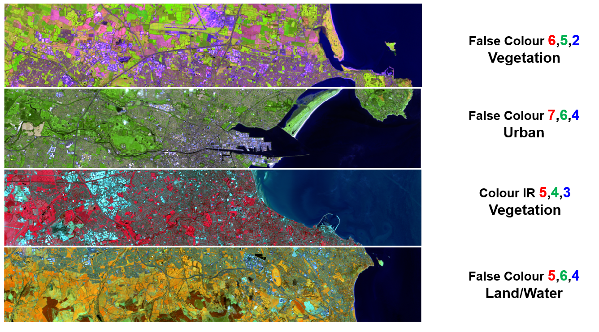

## Objetivos del Módulo

-   Identificar la estructura, propiedades y metadatos de un Raster (resolución, extensión, sistema de referencia).
-   Cargar, visualizar e interpretar bandas satelitales (ej.: Landsat 8) y sus combinaciones color.
-   Ejecutar un flujo mínimo en R para leer y visualizar imágenes Raster (color natural y falso color).

## Definición de Raster

Raster

:   Representación del espacio mediante una matriz de celdas (filas × columnas). Cada celda almacena un valor que describe el fenómeno (p. ej., reflectancia en una banda espectral). Un conjunto de capas apiladas (bandas) forma un raster multicapas..

{width="60%"}

## Características de un Raster

-   Resolución espacial: tamaño de celda en unidades del mapa (p. ej., 30 m).



-   Extensión (extent): rectángulo mínimo que cubre el raster (xmin, xmax, ymin, ymax).

-   Sistema de referencia (CRS): define cómo se ubican las celdas en la Tierra (p. ej., WGS84, UTM).

-   Tipo de dato / profundidad de bit: rango y precisión de los valores (entero, flotante).




-   Valores NoData: celdas sin información válida.

## Imágenes Satelitales (ejemplo: Landsat 8)

Para ejemplificar el uso y ver características de Raster vamos a utilizar una imágenes satelital del [Satelite Landsat 8](https://eos.com/es/find-satellite/landsat-8/).



Este tipo de productos suele distribuirse como series de bandas (p. ej., coastal/aerosol, azul, verde, rojo, NIR, SWIR1, SWIR2, térmica), que combinamos para visualización y análisis.

{fig-align="center" width="500"}

Para este ejemplo de visualización necesitamos conocer las bandas satelitales que componen nuestra imagen satelital.


## Ejemplo Práctico

### Librerías

```{r}
library(terra)
library(raster)
library(mapview)
```


### lectura de imagen Raster.


Para el ejemplo, necesitaremos reconocer qué bandas incluye nuestro archivo y cómo nombrarlas para facilitar su uso:

>la nomenclatura exacta varía según la fuente de datos y el preprocesamiento. En este módulo usaremos nombres legibles que mapean a Landsat 8 OLI/TIRS:
>`aerosol`, `blue`, `green`,  `red`, `nir`, `swir1`, `swir2`, `tirs1`.

:::{.callout-note  appearance="simple" collapse="true"}
## Tabla de Bandas de Imagen satelital Landsat 8


:::

Para asegurar compatibilidad con material existente, mostramos primero con `raster` y, luego, la versión recomendada moderna con `terra`.


```{r}
# install.packages("terra") # si no lo tienes
library(terra)

las_condes_rst <- rast("data/raster/OLI_LC.tif")
names(las_condes_rst) <- c(
  "aerosol", "blue", "green", "red", "nir", "swir1", "swir2", "tirs1"
)

las_condes_rst
crs(las_condes_rst)
res(las_condes_rst)
ext(las_condes_rst)
nlyr(las_condes_rst)
```


### Visualización Raster

Color natural (RGB = 4–3–2): rojo, verde y azul aproximan cómo “veríamos” la escena.

```{r}
# # Visualización de imagen recortada de Las Condes en Color Natural
plotRGB(las_condes_rst, r = 4, g = 3, b = 2, stretch = "lin")
# # mapview::viewRGB(raster::brick(las_condes_rst), r = 4, g = 3, b = 2)
```

:::{.callout-note  appearance="simple" collapse="true"}
## Actividad 1 — Explora combinaciones de bandas


Ensaya falso color vegetación (NIR–Red–Green → 5–4–3 en Landsat 8 clásico; aquí nir=5, red=4, green=3):

```{r eval=FALSE}
plotRGB(las_condes_rst, r = 5, g = 4, b = 3, stretch = "lin")
```

 Referencias: <https://mappinggis.com/2019/05/combinaciones-de-bandas-en-imagenes-de-satelite-landsat-y-sentinel/>


:::


:::{.callout-note  appearance="simple" collapse="true"}

## Actividad 2 — Falso color SWIR (realce de suelos/urbano)

Prueba una combinación que realce zonas urbanas/sequedad (SWIR2–SWIR1–Red → 7–6–4):

```{r}
plotRGB(las_condes_rst, r = 7, g = 6, b = 4, stretch = "lin")
```

¿Qué patrones cambian respecto del color natural? Describe brevemente.

:::


:::{.callout-note  appearance="simple" collapse="true"}

## Actividad 3 — Chequeos rápidos de metadatos
- ¿Cuál es la resolución de tu raster?
- ¿Qué CRS utiliza? ¿Es geográfico (lat/long) o proyectado (p. ej., UTM)?
- ¿Hay NoData? ¿Cómo se representan?

Usa: `res(r)`, `crs(r)`, `is.na(values(r))```.
:::


## Anexo: Compatibilidad con librería `raster`


Para asegurar compatibilidad con material existente, mostramos también con {`raster`} aunque la librería recomendada para el futuro es {`terra`}.


>_`terra` replaces the `raster` package. The interfaces of `terra` and `raster` are similar, but `terra` is simpler, faster and can do more_. Fuente: <https://rspatial.github.io/terra/>

### Lectura e inspección

```{r eval=FALSE}
library(raster)
las_condes_raster <- brick("data/raster/OLI_LC.tif")
names(las_condes_raster) <- 
  c("aerosol", "blue", "green", "red" , "nir", "swir1", "swir2", "tirs1")


# Inspección básica
las_condes_raster
crs(las_condes_raster)# sistema de referencia de coordenadas
res(las_condes_raster)   # tamaño de celda
extent(las_condes_raster) # extensión de la imagen
nlayers(las_condes_raster) # cantidad de capas
```

### Visualización de RGB
```{r eval=FALSE}
# Visualización de Las Condes en color natural
plotRGB(las_condes_raster, r = 4, g = 3, b = 2, stretch = "lin")
# Alternativa interactiva (si la tienes instalada):
# mapview::viewRGB(las_condes_raster, r = 4, g = 3, b = 2)
```


## Referencias:

- [Spatial Data Science with R and “terra”](https://rspatial.org/)
