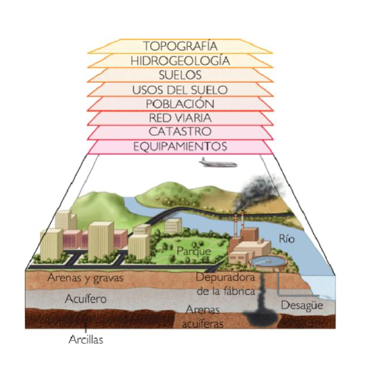
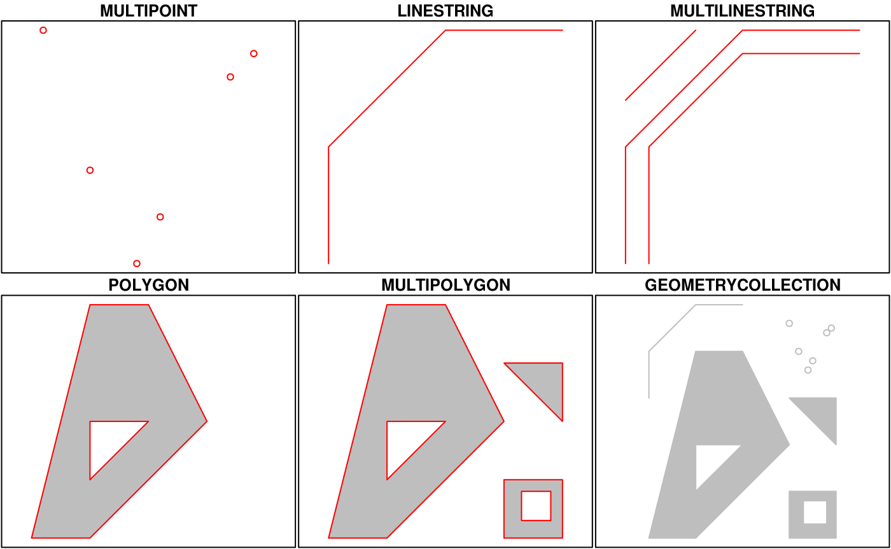
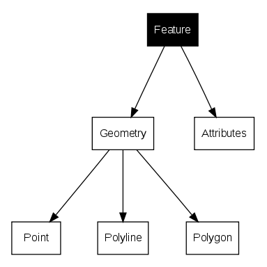

  
```{r setup, include=FALSE}
knitr::opts_chunk$set(echo = TRUE)
suppressPackageStartupMessages(library(dplyr))
suppressPackageStartupMessages(library(sf))
suppressPackageStartupMessages(library(mapview))
suppressPackageStartupMessages(library(kableExtra))
suppressPackageStartupMessages(library(ggplot2))
suppressPackageStartupMessages(require(knitr))
suppressPackageStartupMessages(library(viridis))
suppressPackageStartupMessages(library(tidyr))
```

## Objetivos del Módulo


La presente Sesión tiene como objetivo principal introducir conceptos generales y manipulación básica de datos de tipo vectorial (punto, lineas, polígonos).


## Definición General de Datos Espaciales

La representación de un territorio requiere datos geográficos compuestos por información espacial (geometrías asociadas a una ubicación real en el mundo) e información de atributos (características y variables asociadas a estas geometrías).

{width=50%}


## Datos Vectoriales 

Los datos vectoriales son uno de los tipos fundamentales en los que se representa la información espacial. Este formato se caracteriza por describir los elementos del espacio a través de puntos, líneas y polígonos. Cada uno de estos objetos puede tener atributos asociados que describen características adicionales como el uso del suelo, la densidad poblacional, o cualquier otra variable relevante para el análisis.

En políticas públicas, los datos vectoriales juegan un rol clave en la toma de decisiones, ya que permiten analizar la distribución espacial de fenómenos, desde la localización de infraestructuras hasta la incidencia de eventos sociales y delictivos. A través de las herramientas de análisis vectorial, es posible identificar patrones, relaciones espaciales y tomar decisiones fundamentadas sobre la planificación y gestión del territorio.

En este capítulo, utilizaremos la librería [sf](https://r-spatial.github.io/sf/index.html) para la lectura y manipulación de datos vectoriales en R. Esta librería es ampliamente utilizada en la comunidad de análisis espacial debido a su eficiencia y su integración con otras herramientas como dplyr para el manejo de tablas de atributos.

**Tipos de Datos Vectoriales espaciales básicos**
  
  Representación mediante coordenadas que se pueden unir espacialmente o no. Corresponde a 3 tipos de geometrías: puntos, líneas y  polígonos.




Fuente: [https://r-spatial.github.io/sf/articles/sf1.html](https://r-spatial.github.io/sf/articles/sf1.html)


| Tipo | Descripción |
  |------------------------------------|------------------------------------|
| POINT | Geometría de dimensión cero que contiene un único punto |
| LINESTRING | Secuencia de puntos conectados por segmentos rectos, no auto-intersecantes; geometría unidimensional |
| POLYGON | Geometría con área positiva (bidimensional); la secuencia de puntos forma un anillo cerrado y no auto-intersecante; el primer anillo denota el anillo exterior, cero o más anillos posteriores representan huecos en este anillo exterior |
| MULTIPOINT | Conjunto de puntos; un MULTIPOINT es simple si no hay dos puntos iguales dentro del conjunto |
| MULTILINESTRING | Conjunto de líneas (linestrings) |
| MULTIPOLYGON | Conjunto de polígonos |
| GEOMETRYCOLLECTION | Conjunto de geometrías de cualquier tipo, excepto GEOMETRYCOLLECTION |
  
  
  ### Lectura de Insumos
  
  
  
  El paquete [sf](https://r-spatial.github.io/sf/index.html) facilita la importación de estos datos, que suelen estar en formatos como shapefile (.shp) o GeoJSON (.geojson), etc. la función nativa para esto es `st_read()`. Para los efectos prácticos de esta etapa se utilizará la base de datos del censo a nivel zonal a nivel nacional que en este caso esta almacenado bajo la estrucura `rds` nativa de R, pero manteniendo todos los atributos y geometrías espaciales.


### Puntos

Tiene un par de coordenadas "x" e "y". Es utilizado para información de tipo puntual, como por ejemplo equipamiento urbano, postes, árboles, entre otros.


Cargar librerías
```{r}
# install.packages("sf") 
library(sf) # manipulación de datos vectoriales
library(mapview) # visualización de mapas dinámicos
library(ggplot2) # gráficos
library(RColorBrewer) #paleta de colores

```

#### Lectura de archivos tipo puntos
```{r}
sii_LC <- st_read("data/sii/sii_urbe_LC.shp")
```

#### Visualización de los puntos

```{r}
# Visualización ggplot y sf
ggplot() +
  geom_sf(data = sii_LC, col = "orange", alpha=0.8,  size= 0.5)+
  ggtitle("Datos del SII en Las Condes" ) +
  theme_bw() +
  theme(legend.position="none")+
  theme(panel.grid.major = element_line(colour = "gray80"), 
        panel.grid.minor = element_line(colour = "gray80"))
# mapview(sii_LC, zcol = "atractor", cex =2)
```


## Líneas

Tiene tantas coordenadas como vértices. La información que representa es de tipo lineal, como por ejemplo calles, ríos, redes energéticas, entre otros. Existen las líneas cerradas, las cuales se pueden entender como el perímetro de una superficie (sin relleno).


#### Lectura de líneas
```{r}
las_condes_red <- readRDS("data/redes/RED_LAS_CONDES.rds") 
# las_condes_red

```

#### visualización Líneas

```{r}

ggplot() +
  geom_sf(data = las_condes_red, col = "gray70", alpha=0.8,  size= 0.5)+
  ggtitle("Red víal de la comuna Las Condes" ) +
  theme_bw() +
  theme(legend.position="none")+
  theme(panel.grid.major = element_line(colour = "gray80"), 
        panel.grid.minor = element_line(colour = "gray80"))
# mapview(las_condes_red)
```


## Polígonos

Tiene tantas coordenadas como vértices. La información que representa es de tipo área, como por ejemplo división política administrativa, manzanas, construcciones, entre otras.


#### Lectura de polígonos

```{r}

las_condes_mz <- st_read("data/shape/icv_las_condes.shp", quiet=T) 
# las_condes_ptos

```

#### Visualización polígonos

```{r}

ggplot() +
  geom_sf(data = las_condes_mz, aes(fill = veg_cob), color ="gray80", 
          alpha=0.8,  size= 0.1)+
  scale_fill_distiller(palette="Greens", direction = 1)+
  ggtitle("Cobertura Vegetal de la comuna Las Condes" ) +
  theme_bw() +
  theme(panel.grid.major = element_line(colour = "gray80"), 
        panel.grid.minor = element_line(colour = "gray80"))
# mapview(las_condes_mz, zcol = "veg_cob")
```


## Actividades Prácticas


Seleccione una comuna de las manzanas del INE, visualiza con ggplot. Además genere una tabla resumen de suma de personas, hombres, mujeres viviendas por Zona Censal.

:::{.callout-tip appearance="simple" collapse="true"}

## Tips

Leer Archivo:

```{r eval=FALSE}
mz_ine <- readRDS("../data/censo/manz_INE_2017_sf.rds")
```

Seleccionar Comuna con `dplyr::filter()`

Eliminar geometrías `sf::st_drop_geometry()` ya que no es necesaria para realizar tabla resumen.

:::
  
  
## Manipulación de Datos Vectoriales
  
Además de las geometrías espaciales, los datos vectoriales incluyen una tabla de atributos que contiene información adicional sobre cada objeto espacial. Esta tabla de atributos es esencial para realizar análisis más profundos, ya que nos permite filtrar, seleccionar, crear columnas nuevas y resumir los datos según diferentes criterios.



Para la manipulación de datos vectoriales se usará la sección de atributos que la estructura sf permite para lo cual utilizaremos la librería `dplyr` cómo si fuera un dataframe.


Cargar librerías

```{r}
# install.packages("sf") 
library(sf) # manipulación de datos vectoriales
library(dplyr) # manipulación de tablas de atributos
library(mapview) # visualización de mapas dinámicos
library(ggplot2) # gráficos
library(RColorBrewer) #paleta de colores
library(viridis) #paleta de colores

```

```{r}
# sii_LC <- st_read("data/sii/sii_urbe_LC.shp")
zonas_censales <-  readRDS("data/censo/zonas_urb_consolidadas.rds")

```

```{r echo=FALSE}
#| label: tbl-censo-zonas
#| tbl-cap: Registros de Zonas Censales del Censo 2017

zonas_censales  %>%
  head(6) %>% 
  kbl() %>%
  kable_styling(bootstrap_options = c("striped", "hover", "condensed"), 
                font_size = 10,full_width = F)
```

### Filtros y selección de columnas {#sec-filtros_esp}

Uno de los pasos más comunes en la manipulación de datos vectoriales es filtrar y seleccionar filas o columnas de la tabla de atributos, lo que permite centrarse en elementos específicos para análisis más detallados. Para efectos de practicar la manipulación de datos espaciales se creará un subset de la base de zonas censales de alguna provincia de Chile y se realizarán cálculos sencillos de densidad.

**Filtrar**
  
```{r echo = FALSE}
op_logicos <- tibble::tribble(
  ~Operador,                   ~Comparación,       ~Ejemplo, ~Resultado,
  "x | y",           "x Ó y es verdadero", "TRUE | FALSE",     "TRUE",
  "x & y",         "x Y y son verdaderos", "TRUE & FALSE",    "FALSE",
  "!x", "x no es verdadero (negación)",        "!TRUE",    "FALSE",
  "isTRUE(x)",  "x es verdadero (afirmación)", "isTRUE(TRUE)",     "TRUE"
)

require(knitr)
kable(op_logicos, digits = 3, row.names = FALSE, align = "c",
      caption = NULL)

```

```{r}

# zonas_censales$NOM_PROVIN %>% unique() %>% sort()
zonas <-  zonas_censales %>% 
  filter(NOM_PROVIN == "VALPARAÍSO") %>% 
  filter(URBANO %in% c("VIÑA DEL MAR", "VALPARAÍSO") )

# mapview::mapview(zonas, zcol = "PERS")
```

```{r}
#| label: fig-zonas-censales
#| fig-cap: Zonas Censales de comunas de Valparaíso y Viña del Mar - Urbano


ggplot() +
  geom_sf(data = zonas, aes(fill = PERS), color =NA, 
          alpha=0.8,  size= 0.1)+
  scale_fill_distiller(palette= "YlGnBu", direction = 1)+
  ggtitle("Población Zonas Censales - Urbano" ) +
  theme_bw() +
  theme(panel.grid.major = element_line(colour = "gray80"), 
        panel.grid.minor = element_line(colour = "gray80"))
```

**Selección de columnas**
  
```{r}
zonas <-  zonas %>% 
  dplyr::select(GEOCODIGO,NOM_REGION, NOM_PROVIN, 
                NOM_COMUNA, PERS, URBANO, ESC_JH)

```


### Generación columnas {#sec-mutate_esp}

**Mutate**
  
Cálculo de superficie por polígono

```{r}
zonas <- zonas %>% 
  mutate(AREA = as.numeric(st_area(.))) %>% # en metros cuadrados
  mutate(AREA = AREA/10000) %>% # en hectárea cuadrada
  mutate(DENS_PERS= round(PERS/AREA, 1))

# zonas
```

```{r}
#| layout-ncol: 2

ggplot() +
  geom_sf(data = zonas, aes(fill = PERS), color =NA, 
          alpha=0.8,  size= 0.1)+
  scale_fill_distiller(palette= "YlGnBu", direction = 1)+
  ggtitle("Población Zonas Censales - Urbano" ) +
  theme_bw() +
  theme(panel.grid.major = element_line(colour = "gray80"), 
        panel.grid.minor = element_line(colour = "gray80"))

ggplot() +
  geom_sf(data = zonas, aes(fill = DENS_PERS), color =NA, 
          alpha=0.8,  size= 0.1)+
  scale_fill_distiller(palette= "YlGnBu", direction = 1)+
  ggtitle("Densidad de Población Zonas Censales - Urbano" ) +
  theme_bw() +
  theme(panel.grid.major = element_line(colour = "gray80"), 
        panel.grid.minor = element_line(colour = "gray80"))
```

### Resumen Estadísticos Espaciales {#sec-groupby_esp}

El objetivo de este punto es que con bases de datos espaciales también se pueden hacer resúmenes estadísticos, como se hacen normalmente con bases de datos. Ahora, se creará tabla con las poblaciones y promedio de años de estudio del Jefe de Hogar en todas las comunas de Chile.

Un punto importante para generar esta tabla es eficiente eliminar la geometría para los cálculos ya que la salida será una tabla.

```{r}
tab_com <- zonas_censales %>% 
  st_drop_geometry() %>% # eliminar geometría.
  group_by(NOM_COMUNA) %>% 
  summarise(POB_COM = sum(PERS, na.rm = T),
            ESC_JH_COM = round(mean(ESC_JH, na.rm= T), 1))

```

```{r echo=FALSE}
#| label: tbl-censo-comunas
#| tbl-cap: Registros de Población y Escolaridad por Comuna

tab_com  %>%
  head(10) %>% 
  kbl() %>%
  kable_styling(bootstrap_options = c("striped", "hover", "condensed"), 
                font_size = 16,full_width = F)
```

### Joining  {#sec-joins}

En este caso agregaremos a la tabla de resultados comunales antes creada, a la base de la comuna de Viña del Mar y Valparaíso, utilizaremos la función `left_join`.

](images/lef_join.png){width=50%}


```{r}
zonas <-  zonas %>%
  left_join(tab_com, by = "NOM_COMUNA") %>% # Ojo con las veces que se hace esta operación
  mutate(DIF_EJH_COM = round(( ESC_JH-ESC_JH_COM), 2))
```


```{r}
#| label: fig-zonas-dif-ejh                                                   
#| fig-cap: Diferencias Esc. Jefe Hogar respecto comuna - Urbano


ggplot() +
  geom_sf(data = zonas, aes(fill = DIF_EJH_COM), color =NA, 
          alpha=0.8,  size= 0.1)+
  scale_fill_distiller(palette= "PRGn", direction = 1)+
  ggtitle("Diferencias Esc. Jefe Hogar Zona/Comuna - Urbano" ) +
  theme_bw() +
  theme(panel.grid.major = element_line(colour = "gray80"), 
        panel.grid.minor = element_line(colour = "gray80"))
```


## Operaciones Espaciales con sf

Las operaciones espaciales son el conjunto de herramientas que permiten realizar cálculos y transformaciones sobre los datos espaciales vectoriales. Estas operaciones son fundamentales para análisis de proximidad, intersección, disolución de fronteras y creación de buffers, entre otras.

Podemos clasificar las operaciones sobre geometrías en función de lo que toman como entrada y lo que devuelven como salida. En cuanto a la salida tenemos operaciones que devuelven:
  
- **predicates**: una lógica que afirma una determinada propiedad es `TRUE`
- **measures**: una cantidad (un valor numérico, posiblemente con unidad de medida)
-  **transformations**: nuevas geometrías generadas en cuanto a lo que operan, distinguimos las operaciones que son:
    * **unary** cuando trabajan en una única geometría
    * **binary** cuando trabajan con pares de geometrías
    * **n-ary** cuando trabajan con conjuntos de geometrías


### Operaciones en la misma geometría


#### Unary predicates

Los predicados unitarios describen una determinada propiedad de una geometría. Los predicados `is_simple`, `is_valid`, y `is_empty` devolver respectivamente si una geometría es simple, válida o vacía. Dado un sistema de referencia de coordenadas, `is_longlat` devuelve si las coordenadas son geográficas o proyectadas. es(geometría, clase)\` comprueba si una geometría pertenece a una clase determinada.

```{r}
st_is_valid(zonas) %>% head(10)
```


#### Unary measures

Las medidas unarias devuelven una medida o cantidad que describe una propiedad de la geometría:
  
| medida | devuelve |
|---------------|---------------------------------------------------------|
| `dimension` | 0 para puntos, 1 para líneas, 2 para polígonos, posiblemente `NA` para geometrías vacías |
| `area` | el área de una geometría |
| `length` | la longitud de una geometría lineal |
  
  Ejemplo cuando calculamos el área de cada polígono de zona censal.

```{r eval=FALSE}

# st_area(zonas)

zonas_area <- zonas %>% 
  mutate(AREA = as.numeric(st_area(.))) # área en metros cuadrados

```


#### Unary transformers

Las transformaciones unarias funcionan por geometría y devuelven para cada geometría una nueva geometría.

| transformador | devuelve una geometría ... |   |
  |-----------------|--------------------------------------|-----------------|
| `centroid` | de tipo `POINT` con el centroide de la geometría |  |
| `buffer` | que es más grande (o más pequeña) que la geometría de entrada, dependiendo del tamaño del buffer |  |
| `jitter` | que ha sido movida en el espacio una cierta cantidad, usando una distribución uniforme bivariada |  |
| `wrap_dateline` | cortada en piezas que ya no cruzan ni cubren la línea de cambio de fecha |  |
| `boundary` | con el límite de la geometría de entrada |  |
| `convex_hull` | que forma el envolvente convexo de la geometría de entrada |  |
| `line_merge` | después de unir elementos `LINESTRING` conectados de un `MULTILINESTRING` en `LINESTRING`s más largos |  |
| `make_valid` | que es válida |  |
| `node` | con nodos añadidos a geometrías lineales en las intersecciones sin nodo; solo funciona en geometrías lineales individuales |  |
| `point_on_surface` | con un (arbitrario) punto en una superficie |  |
| `polygonize` | de tipo polígono, creada a partir de líneas que forman un anillo cerrado |  |
| `segmentize` | una geometría (lineal) con nodos a una densidad o distancia mínima dada |  |
| `simplify` | simplificada mediante la eliminación de vértices/nodos (líneas o polígonos) |  |
| `split` | que ha sido dividida con una línea divisoria |  |
| `transform` | transformada o convertida a un nuevo sistema de referencia de coordenadas |  |
| `triangulate` | con polígonos triangulados de Delaunay |  |
| `voronoi` | con la teselación de Voronoi de una geometría de entrada |  |
| `zm` | con coordenadas `Z` y/o `M` eliminadas o añadidas |  |
| `collection_extract` | con sub-geometrías de un `GEOMETRYCOLLECTION` de un tipo particular |  |
| `cast` | que se convierte a otro tipo |  |
| `+` | que se desplaza sobre un vector dado |  |
| `*` | que se multiplica por un escalar o matriz |  |


```{r eval=FALSE}

# st_area(zonas)

zonas_points <- zonas %>% 
  sample_n(10) %>% 
  st_centroid()

```


Otros Ejemplos de operaciones sobre una geometría tipo puntos
  
```{r fig-vor, echo = F}
#| fig.cap: "Para un conjunto de puntos, izquierda: Convex Hull (rojo); centro: Polígonos de Voronoi; derecha: triangulación de Delauney"
#| code-fold: true
#| out.width: 60%
par(mar = rep(0,4), mfrow = c(1, 3))
set.seed(133331)
mp <- st_multipoint(matrix(runif(20), 10))
plot(mp, cex = 2)
plot(st_convex_hull(mp), add = TRUE, col = NA, border = 'red')
box()
plot(mp, cex = 2)
plot(st_voronoi(mp), add = TRUE, col = NA, border = 'red')
box()
plot(mp, cex = 2)
plot(st_triangulate(mp), add = TRUE, col = NA, border = 'darkgreen')
box()
```


#### Unión de Polígonos

Primeramente se creará una geometría comunal basándose en las zonas censales utilizando la función `st_union()`

```{r}
valpo_com <-  zonas %>% filter(NOM_COMUNA == "VALPARAÍSO") %>% 
  st_union()

```

```{r}
#| label: fig-zonas-comu-vlp
#| fig-cap: Resaltar la comuna de Valparaíso

ggplot() +
  geom_sf(data = zonas, aes(fill = DIF_EJH_COM), color =NA, 
          alpha=0.3,  size= 0.1)+
  scale_fill_distiller(palette= "PRGn", direction = 1)+
  geom_sf(data = valpo_com,  color ="magenta", alpha=1,  size= 1, fill = NA)+
  ggtitle("Resaltar la comuna de Valparaíso" ) +
  theme_bw() +
  theme(panel.grid.major = element_line(colour = "gray80"), 
        panel.grid.minor = element_line(colour = "gray80"))
```

#### Buffer

Aplicación de Buffer con la función de `st_buffer`, que tiene el parámetro `dist`que dice relación a los metros que se quiere hacer el buffer (también puede ser negativo)

```{r}
#buffer exterior cuando el valor  de dist es positivo
valpo_com_buffer <-  valpo_com %>% 
  st_buffer(dist = 1000) # %>% st_simplify(dTolerance = 100) 

#buffer interior cuando el valor de dist es negativo
valpo_com_buffer_menos <-  valpo_com %>% 
  st_buffer(dist = - 500) # %>% st_simplify(dTolerance = 100) 

```

```{r}
#| label: fig-buffer-vlp
#| fig-cap: Buffer de la comuna de Valparaíso 1000 y 500 metros.


ggplot() +
  geom_sf(data = valpo_com,  color ="magenta", alpha=0.3,  size= 1, fill = "magenta")+
  geom_sf(data = valpo_com_buffer,  color ="orange", alpha=1,  size= 1, fill = NA)+
  geom_sf(data = valpo_com_buffer_menos,  color ="red", alpha=1,  size= 1, fill = NA)+
  ggtitle("Buffer de la comuna de Valparaíso - 1000 mts." ) +
  theme_bw() +
  theme(panel.grid.major = element_line(colour = "gray80"), 
        panel.grid.minor = element_line(colour = "gray80"))
```


### Operaciones entre multiples geometrías

Una consideración importante, cuando se hacen operaciones espaciales entre dos geometrías es importantes que ambas estén bajo el mismo sistema de referencias de coordenadas, por cual empezaremos con esto a continuación.


#### Transformación de CRS

Los sistemas de coordenadas forman la base de cálculo para describir la posición de un punto a partir de mediciones geodésicas: distancias, proporciones de distancias (sin escala) y ángulos. Las coordenadas nunca pueden medirse, solamente se calculan con referencia un sistema de coordenadas bien definido. Mayores detalles ver la sección en apéndices sobre Sistemas de Referencias de Coordenadas ([@sec-crs]).

Para el caso de Chile usamos dos sistemas de referencias de coordenadas:
  
  Coordenadas elipsoidales (geodésicas):
  
  :   4326 o `"+proj=longlat +datum=WGS84 +no_defs"`

Coordenadas proyectadas (métricas):
  
  :   32719 o `"+proj=utm +zone=19 +south +datum=WGS84 +units=m +no_defs"`

Las medidas unarias devuelven una medida o cantidad que describe una propiedad de la geometría:
  
**Reproyectar Vectores**
  
```{r}
zonas_censales <-  readRDS("data/censo/zonas_urb_consolidadas.rds")
st_crs(zonas_censales)

zonas_utm <- zonas_censales %>% st_transform(32719)
st_crs(zonas_utm)
```


**Reporyección con verificación**

```{r}

# Verificamos el CRS y lo igualamos si es necesario
if (st_crs(las_condes_mz) != st_crs(sii_LC)) {
  sii_LC <- st_transform(sii_LC, st_crs(las_condes_mz))
}

```


#### Binary Predicates

Una lista de predicados binarios es:
  
| predicado | significado | inverso de |
|--------------|---------------------------------------------|--------------|
| `contains` | Ninguno de los puntos de A está fuera de B | `within` |
| `contains_properly` | A contiene a B y B no tiene puntos en común con el límite de A |  |
| `covers` | Ningún punto de B está en el exterior de A | `covered_by` |
| `covered_by` | Inverso de `covers` |  |
| `crosses` | A y B tienen algunos pero no todos los puntos interiores en común |  |
| `disjoint` | A y B no tienen puntos en común | `intersects` |
| `equals` | A y B son topológicamente iguales: el orden de los nodos o el número de nodos puede ser diferente; idéntico a A contiene B y A dentro de B |  |
| `equals_exact` | A y B son geométricamente iguales, y tienen el mismo orden de nodos |  |
| `intersects` | A y B no son disjuntos | `disjoint` |
| `is_within_distance` | A está más cerca de B que una distancia dada |  |
| `within` | Ninguno de los puntos de B está fuera de A | `contains` |
| `touches` | A y B tienen al menos un punto en el límite en común, pero ningún punto interior |  |
| `overlaps` | A y B tienen algunos puntos en común; la dimensión de estos es idéntica a la de A y B |  |
| `relate` | Dado un patrón de máscara, devuelve si A y B se adhieren a este patrón |  |
  
  La [página DE-9IM de Wikipedia](https://en.wikipedia.org/wiki/DE-9IM) proporciona los patrones `relate` para cada uno de estos verbos. Es importante importante comprobarlos; por ejemplo, *covers* y *contains* (y sus (y sus inversos) no suelen ser del todo intuitivos:
  
-   si A *contiene* B, B no tiene puntos en común con el exterior *o frontera* de A
-   si A *cubre* B, B no tiene puntos en común con el exterior de A


#### Ejemplo:

Supongamos que tenemos una cantidad de puntos del servicio impuesto interno y necesitamos atribuirle la información de la manzana de las Condes y en específico no interesa el id manzana (`MANZENT_I`) y la cobertura vegetal (`veg_cob`).


```{r}
# 1) Asegurar mismo CRS
if (st_crs(las_condes_mz) != st_crs(sii_LC)) {
  sii_LC <- st_transform(sii_LC, st_crs(las_condes_mz))
}


# 2) (Opcional) Quedarse solo con columnas de interés del polígono
polys <- las_condes_mz %>%
  select(MANZENT_I, veg_cob)  

```

**Join estricto (punto dentro del polígono)**

Usa st_within (inverso de contains). No asigna atributos a puntos en el borde.

```{r}
# Unir atributos del polígono al punto si el punto está DENTRO del polígono
sii_join_within <- st_join(
  x    = sii_LC, 
  y    = polys, 
  join = st_within,     # predicado binario
  left = TRUE           # conserva todos los puntos
)

# Chequeo: ¿cuántos puntos quedaron sin polígono? (NA en id_manz)
sum(is.na(sii_join_within$id_manz))
```


```{r}
# Visualización ggplot y sf
library(viridis)
library(ggplot2)

ggplot() +
  geom_sf(data = sii_join_within,
          aes(color = veg_cob),
          alpha = 0.8, size = 0.8) +
  scale_color_viridis_c(na.value = "grey80") +
  ggtitle("Datos del SII en Las Condes — Cobertura de Vegetación") +
  theme_bw() +
  theme(
    legend.position = "right",
    panel.grid.major = element_line(colour = "gray80"),
    panel.grid.minor = element_line(colour = "gray90")
  )
# mapview(sii_join_within, zcol = "veg_cob", cex =2)
```


#### Transformaciones Binarias

Los transformadores binarios son funciones que devuelven una geometría basada en operar sobre un par de geometrías. Incluyen:
  
| función | devuelve | operador infijo |
  |----------------|-----------------------------------------|:--------------:|
| `intersection` | las geometrías superpuestas para un par de geometrías | `&` |
| `union` | la combinación de las geometrías; elimina límites internos y puntos, nodos o segmentos de línea duplicados | `|` |
| `difference` | las geometrías de la primera después de eliminar la superposición con la segunda geometría | `/` |
| `sym_difference` | las combinaciones de las geometrías después de eliminar donde se intersectan; la negación (opuesto) de `intersection` | `%/%` |
  
  


## Referencias

[R para Ciencia de Datos.](https://es.r4ds.hadley.nz/13-relational-data.html#entendiendo-las-uniones)
              
[Simple Features for R](https://r-spatial.github.io/sf/)
              