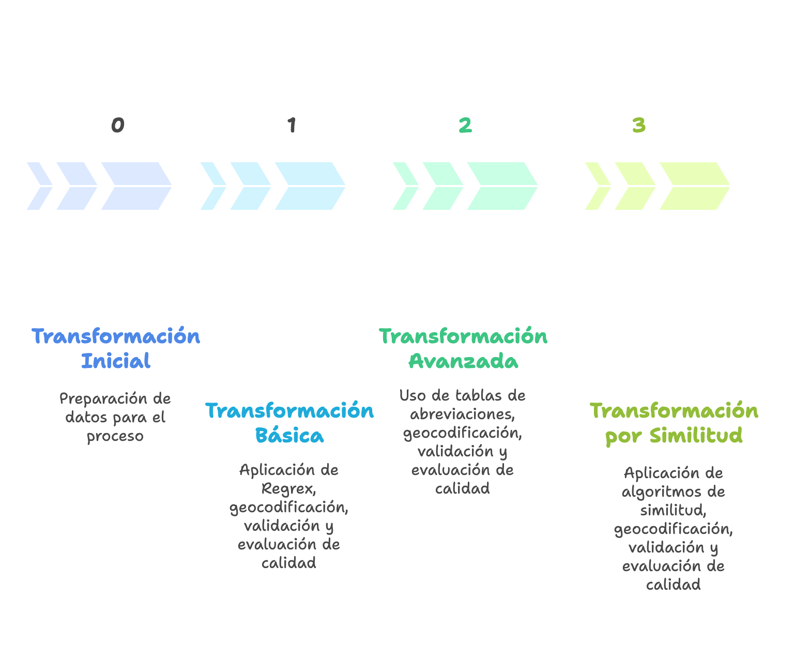

# Geocoding

```{r setup, include=FALSE}
# parámetros
font_size = 2
n_head = 10
# librerías
suppressPackageStartupMessages(library(sf))
suppressPackageStartupMessages(library(dplyr))
suppressPackageStartupMessages(library(purrr))
suppressPackageStartupMessages(library(readr))
suppressPackageStartupMessages(library(kableExtra))
suppressPackageStartupMessages(library(mapdeck))
suppressPackageStartupMessages(require(knitr))
suppressPackageStartupMessages(library(tidygeocoder))
suppressPackageStartupMessages(library(tidyr))
suppressPackageStartupMessages(library(stringdist))

```


## Introducción

La geocodificación consiste en traducir descripciones textuales de direcciones a coordenadas geográficas (puntos), lo que permite incorporarlas a un análisis espacial. En contextos hispanos, la amplia variabilidad en los formatos de escritura de direcciones —abreviaciones, uso de diacríticos, numeraciones, referencias a kilómetros o parcelas, y complementos adicionales— exige un pipeline estructurado. Este debe integrar [normalización determinística, diccionarios de abreviaciones y métodos de similitud]{.verde}, antes de consultar motores de geocodificación externos.

El proceso de geocodificación debe ser [flexible y adaptable]{.verde} a los diferentes tipos y estructuras de direcciones. Por ello, resulta fundamental contar con un flujo de trabajo que permita transformar las direcciones en etapas sucesivas, mejorando gradualmente la calidad de los resultados. Esta organización facilita la trazabilidad, el control de calidad y la incorporación de ajustes o transformaciones adicionales cuando sea necesario. A continuación, se presenta una visión resumida del pipeline básico que trabajaremos en esta clase.

**Visión del Pipeline Básico**


```
Dirección cruda
  │
  ├─▶ [0] Preparación
  │
  ├─▶ [1] Básica 
  │      ├─▶ Transformación por Regex Funciones
  │      ├─▶ Geocodificación 
  │      ├─▶ Validación Espacial → ✔️ fin | ✖️ pasa a [2]
  │      └─▶ Calidad de Etapa
  │
  ├─▶ [2] Avanzada
  │      ├─▶ Transformación por Tablas de Abreviaturas
  │      ├─▶ Geocodificación #2
  │      ├─▶ Validación Espacial → ✔️ fin | ✖️ pasa a [3]
  │      └─▶ Calidad de Etapa
  │
  └─▶ [3] Similitud
         ├─▶ Transformación por Similitud de Palabras
         ├─▶ Geocodificación #3 (si score<τ, usar motor alterno o Rezagados)
         ├─▶ Validación Espacial → ✔️ fin | ✖️ Rezagados
         └─▶ Calidad de Etapa y Final
```

---

## Pasos

Cada etapa del pipeline sigue la misma secuencia de pasos: [transformación de la dirección, geocodificación, validación espacial]{.verde} de los resultados y, finalmente, [evaluación de calidad]{.verde}. A continuación, se describen en detalle estos pasos comunes a todas las etapas.


### Transformación (varía según etapa)

Estandariza la cadena de entrada (**corrección, normalización, limpieza**), enriqueciendo con reglas y diccionarios según la etapa.

### Geocodificación

Un motor geográfico de geocodificación es el sistema que convierte una dirección normalizada en coordenadas (latitud, longitud) usando una base de datos de referencia (calles, portales, topónimos, límites administrativos). Puede ser abierto (ej. Nominatim, Pelias) o comercial (ej. Google Maps, Here, Mapbox).

**Variables clave al momento de geocodificar**

- Cadena de consulta: dirección completa o tokens estructurados.
- País / región: restringen la búsqueda.
- Bounding box / viewbox: acota la búsqueda espacial.
- Nivel de detalle (addressdetails): define si devuelve calle, comuna, provincia, país.
- Número de resultados (limit): controla cuántas coincidencias se devuelven.
- Formato de salida (format): JSON, XML, etc.
- User-Agent / Email: requerido en OSM para trazabilidad.
- Rate limiting: número máximo de consultas permitido.

En la práctica se utilizarán motores libres basados en OpenStreetMap (OSM), principalmente Nominatim, respetando sus términos de uso y buenas prácticas.


### Validación

Confirma consistencia espacial (**Point-in-Polygon** contra la comuna/municipio esperado) y jerárquica (comuna–provincia–región).

### Calidad (evaluación de métricas)

Mide el desempeño: **match rate**, porcentaje de acierto, cobertura por comuna, y contribución de cada etapa.

## Etapas



### 0. Transformación Inicial: Preparación de Datos

- Seleccionar columnas necesarias y nombres estándar (p. ej., `id`, `direccion_raw`, `comuna`/`municipio`, `region`, `pais`).
- Crear **id único** (UUID/Hash) para trazabilidad.


### 1. Transformación Básica: Regex y funciones

- Normalización mínima: mayúsculas, quitar diacríticos, compactar espacios, estandarizar símbolos (`#`, `Nº`, `NUM`).
- Extracción de **tokens**: `tipo_via`, `nombre_via`, `numero`, `km`, `complementos`.
- Primer intento de geocodificación con cadena limpia.

### 2. Transformación Avanzada: Tablas de abreviaciones

- Aplicar **diccionarios** muchos→uno (AV/AVDA/AVENIDA → AVENIDA; PJE/PSJE → PASAJE; O'HIGGINS ↔ OHIGGINS).
- Reintentar geocodificación con dirección estandarizada.

### 3. Transformación por Similitud: Algoritmos (p. ej., Jaro–Winkler)

- Generar **candidatos** desde un maestro de calles.
- Puntuar con [Jaro–Winkler]{.verde}, Levenshtein/Damerau, Token Sort/Set, TF–IDF trigramas.
- Reintentar geocodificación con dirección ajustada por similitud.


## Pipeline Completo


```{mermaid}
%%{init: {
  "theme": "base",
  "themeVariables": {
    "fontFamily": "Inter, Segoe UI, Roboto, sans-serif",
    "primaryTextColor": "#0f172a",
    "lineColor": "#94a3b8",
    "tertiaryColor": "#f8fafc"
  },
  "flowchart": { "htmlLabels": false, "curve": "basis" }
}}%%

flowchart TB
  %% ====== Definición de estilos ======
  classDef input fill:#E8F1FF,stroke:#3B82F6,stroke-width:1px,color:#0b3d91;
  classDef s0 fill:#F8FAFC,stroke:#64748B,stroke-width:1px,color:#0f172a;
  classDef s1 fill:#FFFFFF,stroke:#3B82F6,stroke-width:1.5px,color:#0f172a;
  classDef s2 fill:#FFFFFF,stroke:#10B981,stroke-width:1.5px,color:#0f172a;
  classDef s3 fill:#FFFFFF,stroke:#A3BE00,stroke-width:1.5px,color:#0f172a;
  classDef decision fill:#FEF3C7,stroke:#F59E0B,stroke-width:1px,color:#713f12;
  classDef qa fill:#F0F9FF,stroke:#0EA5E9,stroke-width:1px,color:#0c4a6e;
  classDef finish fill:#ECFDF5,stroke:#16A34A,stroke-width:1.5px,color:#065f46;
  classDef backlog fill:#FFF1F2,stroke:#FB7185,stroke-width:1px,color:#7f1d1d;

  %% ====== Entrada ======
  IN["Dirección cruda"]:::input

  %% ====== [0] Preparación ======
  subgraph S0 ["[0] Preparación"]
    direction TB
    s0c["Selección de Columnas necesarias"]:::s0
    s0b["Generación de ID"]:::s0
  end

  %% ====== [1] Básica ======
  subgraph S1 ["[1] Básica"]
    direction TB
    s1a["Transformación por Regex / funciones"]:::s1
    s1b["Geocodificación #1"]:::s1
    s1c{"Validación Espacial"}:::decision
    s1d["Calidad de etapa"]:::qa
  end

  %% ====== [2] Avanzada ======
  subgraph S2 ["[2] Avanzada"]
    direction TB
    s2a["Transformación por tablas de abreviaturas"]:::s2
    s2b["Geocodificación #2"]:::s2
    s2c{"Validación Espacial"}:::decision
    s2d["Calidad de etapa"]:::qa
  end

  %% ====== [3] Similitud ======
  subgraph S3 ["[3] Similitud"]
    direction TB
    s3a["Transformación por similitud de palabras"]:::s3
    s3t{"¿score ≥ τ?"}:::decision
    s3b["Geocodificación #3"]:::s3
    s3alt["Motor alterno / Rezagados"]:::backlog
    s3c{"Validación Espacial"}:::decision
    s3d["Calidad de etapa y FINAL"]:::qa
  end

  %% ====== Salidas ======
  OUT["Dirección geocodificada + metadata de calidad"]:::finish
  REZ["Rezagados"]:::backlog

  %% ====== Flujo ======
  IN --> S0 --> S1
  s1a --> s1b --> s1c
  s1c -- "✔ válido" --> OUT
  s1c -- "✖ → [2]" --> s1d --> S2

  s2a --> s2b --> s2c
  s2c -- "✔ válido" --> OUT
  s2c -- "✖ → [3]" --> s2d --> S3


  s3c -- "✔ válido" --> OUT
  s3c -- "✖ inválido" --> s3d --> REZ
  s3a --> s3t
  s3t -- "Sí" --> s3b --> s3c
  s3t -- "No" --> s3alt

  %% ====== Estilos de subgrupos ======
  style S0 stroke:#64748B,stroke-width:1.5px,fill:#F8FAFC
  style S1 stroke:#3B82F6,stroke-width:2px,fill:#F8FBFF
  style S2 stroke:#10B981,stroke-width:2px,fill:#F6FFFB
  style S3 stroke:#A3BE00,stroke-width:2px,fill:#F9FFE6

```


---

## Geocodificación en R

### Recursos Previos

#### Librerías que se utilizarán 

```{r}
library(sf)
library(dplyr)
library(tidygeocoder)
library(tidyr)
library(stringdist)
library(openxlsx)
library(janitor)
library(mapview)
library(stringr)
```


#### Funciones Auxiliares

```{r}

# Función Si no existe directorio lo crea
make_dir <- function(path){
  if (!dir.exists(path)) dir.create(path, recursive = TRUE)
}

```


### Etapa: 0. Transformación Inicial: Preparación de Datos

**Objetivo**: asegurar insumos limpios, trazables y reproducibles.


#### Crear Directorios y Variables

```{r}
# crear un vector con rutas
path_etapas <- c(0:3) %>% 
  paste0("etapa_", .) %>% 
  paste0("../geocoding/", .)

# Crear directorio en la tuta correspondiente
for (etapa in path_etapas) {
  print(paste0("Creando carpeta en ", etapa))
  make_dir(etapa)
}  

# lo mismo anterior (programción funcional)
# purrr::map(.x = path_etapas, .f = make_dir) 
```


```{r}
make_dir("resultados")
```


