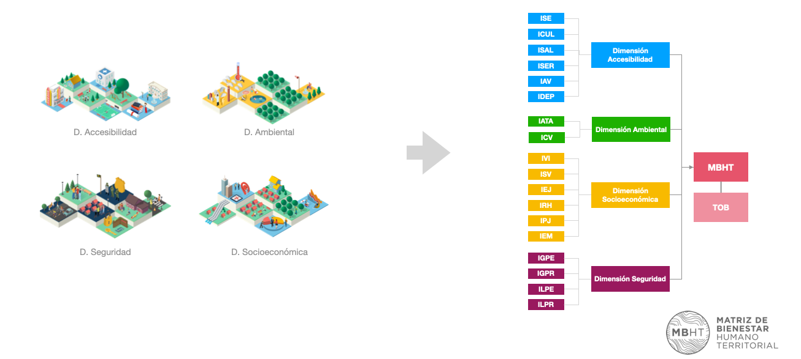
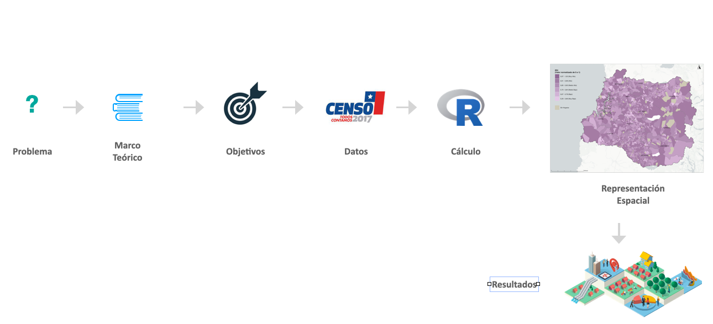
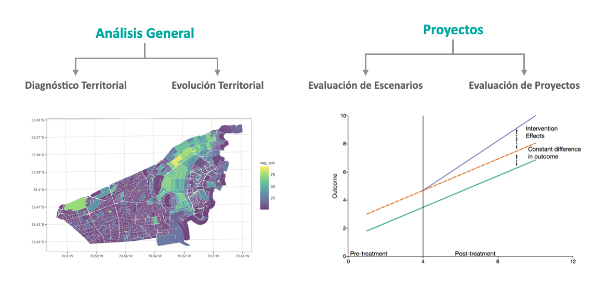
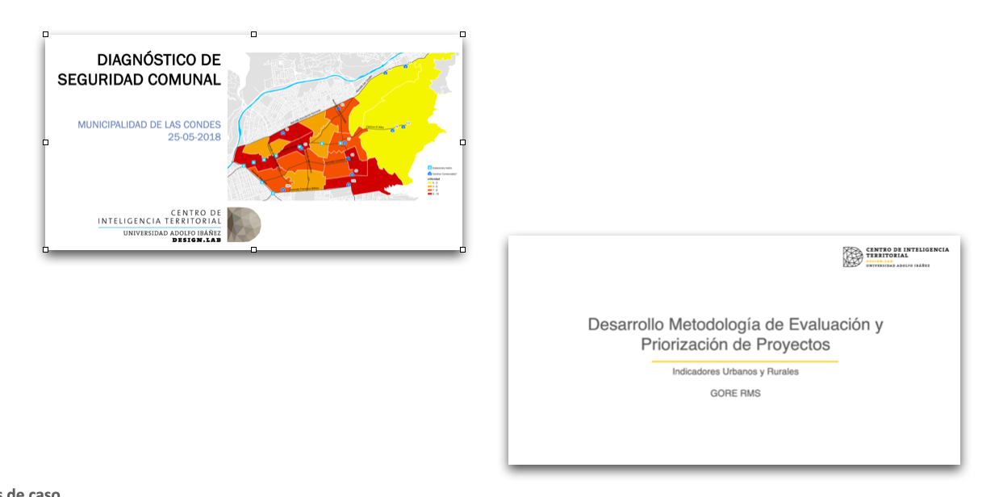

## Introducción

Los indicadores territoriales son herramientas esenciales en el análisis espacial y la planificación territorial, proporcionando una representación cuantitativa de diversas dimensiones del desarrollo en un área geográfica específica. Estos indicadores son fundamentales para entender y evaluar el estado actual y las tendencias de los territorios en aspectos económicos, sociales, ambientales y de bienestar. Al ofrecer una visión integral y detallada del territorio, los indicadores territoriales permiten a los tomadores de decisiones, planificadores urbanos y académicos identificar fortalezas, debilidades, oportunidades y amenazas en sus respectivas áreas de interés.

En esta primera sesión del curso, exploraremos los conceptos básicos y la importancia de los indicadores territoriales, así como introduciremos algunas de las principales herramientas y recursos disponibles para el análisis de estos indicadores. La sesión también incluirá una revisión de aplicaciones prácticas de indicadores territoriales a través de estudios de caso, destacando cómo se han utilizado en proyectos reales para evaluar políticas públicas y proyectos de desarrollo.

## Definición y Conceptos Básicos

### Indicadores

Un indicador es un instrumento que proporciona información sobre una condición, situación, actividad o resultado específico. Este instrumento permite definir un punto de comparación para establecer diferencias entre individuos o respecto a sí mismo en diferentes momentos en el tiempo. Los indicadores se construyen mediante análisis y operaciones técnicas que entregan una medida cuantitativa (valor) o una descripción cualitativa (caracterización) de la magnitud o criterio que se pretende medir u observar.

### Indicadores territoriales.

{fig-align="center" width="400"}

Un indicador territorial es un instrumento que proporciona información específica sobre una condición, situación, actividad o resultado en un **área geográfica delimitada**. A diferencia de un indicador general, un indicador territorial integra la dimensión espacial en su análisis, permitiendo evaluar y comparar aspectos económicos, sociales, ambientales y de bienestar dentro de un territorio particular.

## Tipos de Indicadores Territoriales

{fig-align="center"}

-   Indicadores Accesibilidad
-   Indicadores sociodemográficos
-   Indicadores seguridad
-   Indicadores ambientales

## Pasos para la Construcción de Indicadores T.

{fig-align="center"}

1.  **Presentación del Problema**: Introducción al contexto y naturaleza del problema que se desea abordar con los indicadores territoriales.
2.  **Definir un Marco Teórico o de Referencia**: Establecer las teorías, conceptos y estudios previos que guiarán el análisis y la construcción de indicadores.
3.  **Definición de Objetivos**: Clarificación de lo que se espera lograr con el estudio y la construcción de indicadores territoriales.
4.  **Recolección de dato**s: Identificación y recopilación de los datos necesarios para calcular los indicadores territoriales.
5.  **Cálculo de Indicador Territorial**: Proceso de cálculo del indicador territorial a partir de los datos recolectados.
6.  **Representación Espacial**: Visualización de los indicadores territoriales mediante cartografía.
7.  **Análisis de Resultados**: Interpretación y evaluación de los resultados obtenidos a partir de los indicadores territoriales.

## Aplicaciones de Indicadores Territoriales

{fig-align="center"}

-   Diagnóstico Territorial
-   Evolución Territorial
-   Evaluación de Escenarios
-   Evaluación de Proyectos (impacto a largo plazo)

## Estudios de caso

{fig-align="center"}

## Lecturas y Recursos Adicionales

-   [Plataforma de MBHT](https://plataformabht.subdere.gov.cl/)
